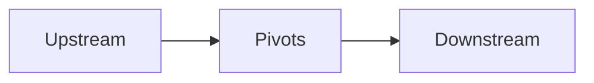

# Database-less approach.
Commits that have been built are tagged with the produced version. These tags are annotated with the "build content":
- A **list of package@version dependencies** consumed by the built version. Can technically be empty but this almost never happen.
- A **list of package identifiers produced**. This is empty for a terminal solution that doesn't produce packages but only build assets.
- A **list of build asset files** that are the "deployment" files. Empty for solutions that only produce packages.

Example of a build content:
```
5 Consumed Packages: CK.DB.Actor@28.0.0--ci.6, CK.DB.Tests.NUnit@33.0.0--ci.11, DotNet.ReproducibleBuilds@1.2.25, Microsoft.NET.Test.Sdk@18.0.1, NUnit3TestAdapter@6.1.0
2 Produced Packages: CK.DB.User.SimpleInvitation, CK.DB.User.SimpleInvitation.Tests
0 Asset Files:
```

The state of the system is in the repositories. External "Databases" centralized in the stack repositories like the `PublishedRelease.cache` and `$Local/LocalRelease.cache`,
when they exist are only "index" that are here to boost the performance and ease the implementation of the build process and issue detections.
They can be rebuilt from scratch any time from the World's repositories (the `ckli maintenance release-database rebuild` command fully rebuilds these 2 files).

__Important:__ This is a key point of the architecture.

In practice, even the content of the tags can be rebuilt: empty or lightweight tags that are parsable as versions are automatically detected
issues that can be automatically fixed by rebuilding their target commit, generating the tag message from the build result and modifying
the tag (that will be pushed to the "origin" repository during publication).

# Workflows

We tried hard to offer the most simple possible workflows. We eventually come up with only 3 different workflows:
- The **Production Workflow**, when you want to produce new stable or pre-releases versions: `ckli *build` and `ckli *publish`.
- The **CI Workflow**, when you need to produce temporary artifacts: `ckli ci *build` and `ckli ci *publish`.
- The **Fix Workflow**, when you need to produce and dispatch a fix to an already released version: `ckli fix start`, `ckli fix build`, `ckli fix publish` and  `ckli fix cancel`.

_**Words matter:**_
- **build** is local, artifacts are produced but remains on the local system (in the stack `$Local/NuGet/` and `$Local/Assets/` folders);
- **publish** means **build + push**: the artifacts are uploaded and remote repositories are impacted (branches, tags are pushed).

## Production & CI

### Build roadmap
These 2 workflows rely on the same roadmap resolution. The strong assumption here is: the versions across the World will always be homogeneous, there
will never be any discrepancies. To understand how it works, one simply need to consider that:
- in a World that contains N repositories;
- given a **branch** (let's take the "stable" one);
- given a subset of the N repositories called the _Pivots_;
- then a repository can:
  - be an upstream of the pivots;
  - belong to the Pivots;
  - be a downstream of the pivots;



Now, from a checked out World, depending on whether each repository on its **branch** has some code change (let's call the "dirty"), a roadmap can
be computed in 2 ways:
- `ckli build` and `ckli publish` will consider the dirty Pivots and impact their downstream repositories.
- `ckli *build` and `ckli *publish` will consider the Pivots and their upstreams that are dirty and impact their downstream repositories.

The `*` verbs guaranty that any change that may impact the Pivots are considered. Without the star, only the Pivots are considered but in both case,
the set of generated artifacts by the operation added to the current set of artifacts is guaranteed to produce a set of homogeneous artifacts.

There is currently only one way to define the Pivots: the current directory where the `ckli` command is executed drives the selection.
- Executing `ckli build` at the root of a World makes all repository Pivots: `ckli build` is the same as `ckli *build`.
- Executing `ckli build` from a repository minimize the impact on the graph: only the work in this repository and its impact will be considered.
- Executing `ckli *build` from a repository can be an optimization: this will produce a "totally up-to-date" version of this repository, including
  any dirty upstream repositories (but only them).

### CI vs. Production
From the 

The `ckli ci` namespace handled CI builds. These builds always consider the "dev/" branch.

The `ckli build/publish` produces non CI builds: the version may be a prerelease (`v1.2.0-a`) but not a CI one.
These non-CI builds are produced by merging the "dev/" into the release branch (and deleting the "dev/" branch: we say that the "dev/" branch
has been integrated into its branch).


## Fix
A fix is rooted in an initial repository (the culprit, the origin). The workflow is based on a branch dedicated to the fix and in which the development will
be done. One origin fix in a repository obviously impacts multiple downstream repositories. What may be less obvious is that more than one versions
in a downstream repository may require a fix, that in turn can trigger multiple other fixes in downstream repositories.

Th minimal workflow is:
1. `cd <repo>`
2. `ckli fix start vMajor[.Minor]`
3. develop, test, commit (in the `fix/vMajor.Minor` branch).
4. `ckli fix publish`
5. Or `ckli fix cancel`

Starting a fix creates a "fix context" for the World that contains the impacts of the
fix on the downstream repositories: one "fix/vMajor.Minor" branch is created in the
origin `<repo>` and one or more "fix/vMajor.Minor" are created in every repository (recursively)
that have non deprecated released versions that must be updated.

This fix context is unique: the fix must be published or canceled before another fix is started.
Canceling a fix preserves the work that may have been done in the different repositories, the branches
with their commits if any are left as-is and the same fix can be restarted anytime.

Publishing the fix compiles, tests and propagates the fixed packages recursively to the fix branches of the downstream repositories
and this is an "atomic" operation: if the `ckli fix publish` fails, the downstream repositories are restored. No version tags appear
and no build artifacts are left in the `$Local/` folder.

To be able to work in downstream repositories (to investigate issues or fixing code impacted by the fix), then the `ckli fix build` command must be used.
This **build** command produces local-only artifacts with a prerelease version `Major.Minor.Patch-local.fix.N` of the fix. These short-lived prerelease
versions of the fix cannot be published, are kept alive locally and replaced by subsequent prerelease (and the final fix).

### Example
Given a very simple world with the following repositories and already released versions:

|Repo|Depends on|Release n°1 (CKt-Core 1.0) |Release n°2 (CKt-Core 1.1)|
|----|----------|--------|--------|
|CKt-Core||v1.0.0|v1.1.0|
|CKt-ActivityMonitor|=> CKt-Core|v0.1.0  => CKt-Core@1.0.0|v0.2.0 => CKt-Core@1.1.0|
|CKt-PerfectEvent|=> CKt.ActivityMonitor|~~v0.2.0~~, v0.2.1 => CKt-ActivityMonitor@0.1.0, ~~v0.3.0~~, v0.3.2  => CKt-ActivityMonitor@0.1.0|v0.4.0 => CKt-Core@0.2.0|
|CKt-Monitoring|=> CKt.ActivityMonitor|v0.2.3 => CKt.ActivityMonitor@0.1.0|v0.3.0 => CKt.ActivityMonitor@0.2.0|

Note that the **Depends on** column has no true meaning and appears here to help understanding this (easy) structure: this can change for each released
version, **each commit defines its own repository dependencies**.

The _CKt-PerfectEvent_ has 4 existing releases (the v0.3.1 is missing, it may have been deprecated), but the v0.2.0 and v0.3.0
have already been fixed: they are by design out of scope for the Fix workflow.

Trying to `ckli fix start v1.1` is an error because it is the current stable release:
```
The version to fix 'v1.0.0' is the current last stable version.
Use the regular 'ckli build/publish' or 'ckli ci build/publish' workflows to produce a fix.
```

But `ckli fix start v1.0` produces this fix workflow:
```
Fixing 'v1.0.0' on CKt-Core:
0 - CKt-Core            -> 1.0.1 (fix/v1.0) 
1 - CKt-ActivityMonitor -> 0.1.1 (fix/v0.1) 
2 - CKt-PerfectEvent    -> 0.2.2 (fix/v0.2) 
3 - CKt-PerfectEvent    -> 0.3.3 (fix/v0.3) 
4 - CKt-Monitoring      -> 0.2.4 (fix/v0.2) 
❰✓❱
```
The `fix/` branches are created and available to host the required code changes. We can see here that _CKt-PerfectEvent_
requires 2 branches and will produce 2 fixes:

|ckli fix build|ckli fix publish|
|--------------|--------------|
CKt.Core@1.0.1-local.fix.2|CKt.Core@1.0.1|
CKt.ActivityMonitor@0.1.1-local.fix.2|CKt.ActivityMonitor@0.1.1|
CKt.PerfectEvent.0.2.2-local.fix.3|CKt.PerfectEvent@0.2.2|
CKt.PerfectEvent.0.3.3-local.fix.3|CKt.PerfectEvent@0.3.3|
CKt.Monitoring@0.2.4-local.fix.2|CKt.Monitoring@0.2.4|

**Note:** for **build**, the commit depth (2 or 3 here) depends on the actual work in the repository and evolves.


